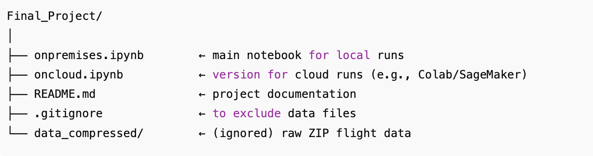

# Flight Delay Prediction using Machine Learning

## Project Overview

This project uses U.S. domestic flight data to predict whether a flight will be delayed by more than 15 minutes.  
The goal is to improve the travel booking experience by alerting customers of potential delays **before booking**.

The dataset comes from the Bureau of Transportation Statistics (BTS) Airline On-Time Performance data.

---

## Problem Definition

The task is to **classify flights** as:

- `1` → Delayed (arrival delay > 15 minutes)
- `0` → On time (arrival delay ≤ 15 minutes)

We use machine learning models such as **Logistic Regression** to learn from historical flight data.

---

## Repository Structure



## Installation and Setup

1. **Clone this repository**
   ```bash
   git clone https://github.com/nuzhatmila1997/Final-Project.git
   cd Final-Project
   ```
2. **Create a virtual environment**

   ```bash
   python -m venv venv
   source venv/bin/activate # On Mac/Linux
   venv\Scripts\activate # On Windows

   ```

3. **Run the notebook**

   Open onpremises.ipynb in Jupyter or VS Code and run all cells.

### What the Code Does

Data Extraction: Unzips monthly CSV files from BTS flight datasets.

Preprocessing: Filters key columns and top airports/airlines.

Feature Engineering: Encodes categorical variables, creates “hour of day”.

Modeling: Trains a Logistic Regression model.

Evaluation: Reports accuracy, recall, precision, sensitivity, specificity, and ROC-AUC.

Visualization: Plots confusion matrix and ROC curve.

### Expected Output

When you run the notebook:

You’ll see metrics like Accuracy, Precision, Recall, Sensitivity, Specificity.

A Confusion Matrix plot showing true vs. predicted delays.

A ROC Curve plot showing the model’s classification ability.

### Next Steps

Handle class imbalance (e.g., SMOTE, class weights).

Add weather and airport congestion data.

### Author

Fariha Nuzhat Majumdar
University of Canberra <br>
ID: u3272137
